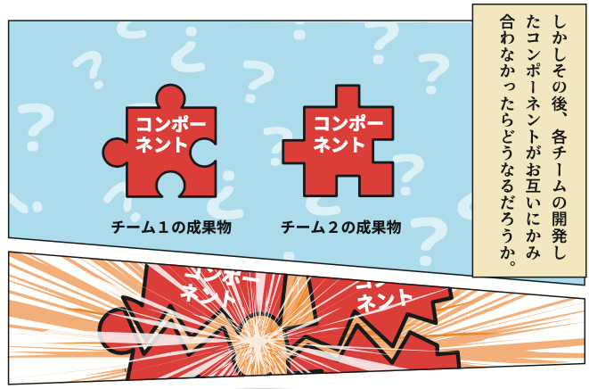
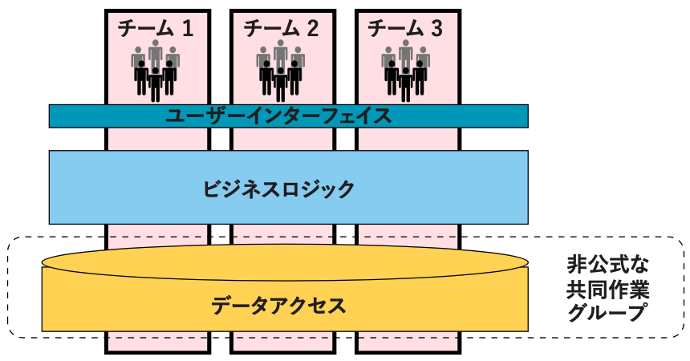
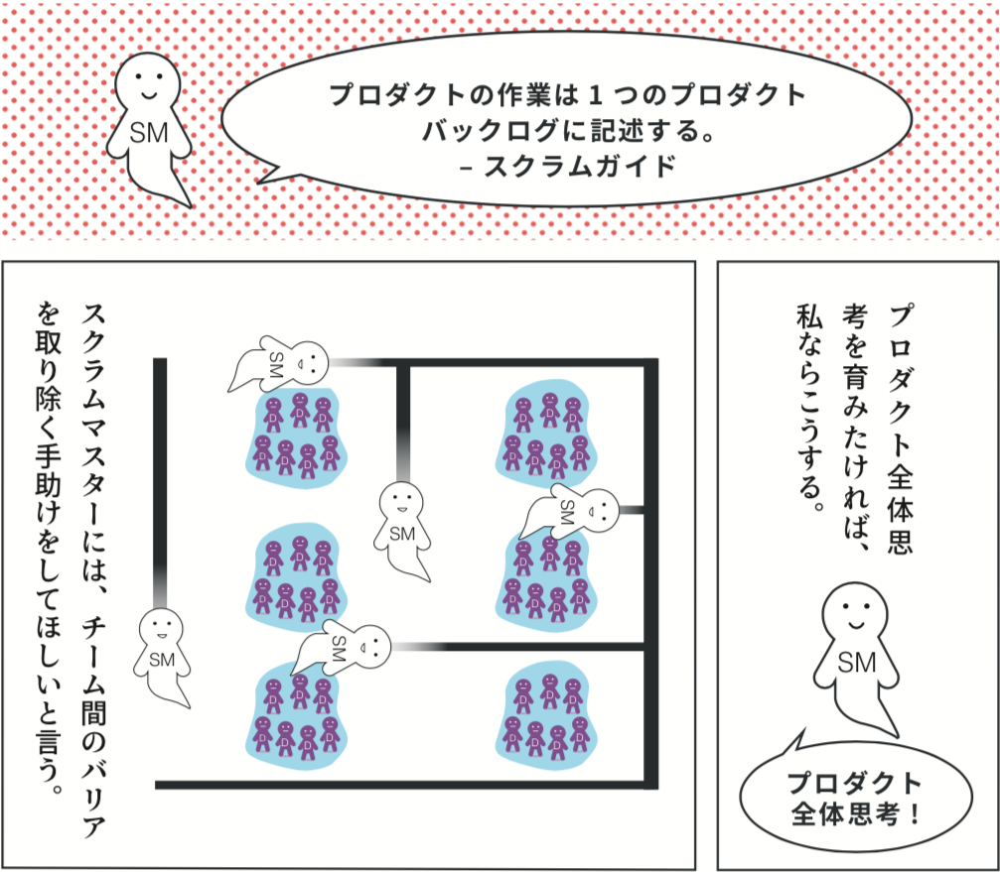
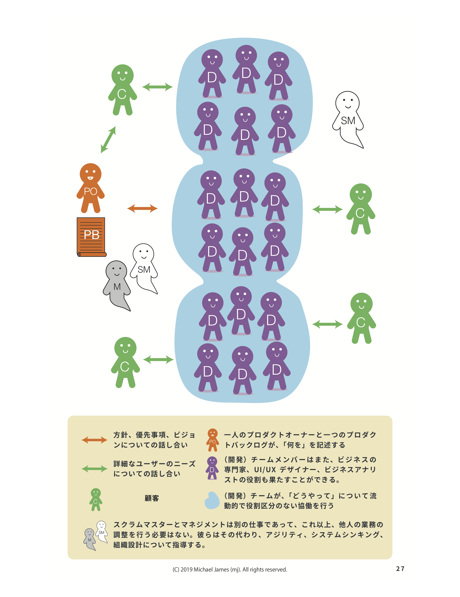

{::comment}
title: 'Large Organization Software Development Misconception #4: Will Parts Made By Different Teams Fit Together By Magic?'
{:/comment}

{::comment}
## Misconception 4.1: Will Components From Different Teams Integrate Into A Feature Without Teams Working Together?
{:/comment}

## 誤解4.1：各チームが開発したコンポーネントを、チームの連携なしで一つのフィーチャーに統合できるか？

{::comment}
By "components" I'm usually referring to architectural layers within the software, such as front end, back end, "platform," a device driver, etc.  Too many large organizations have teams that can only work on components.

*Avoid Component Teams and Delayed Integration*
{:/comment}

私が「コンポーネント」と言う場合は、通常、フロントエンド、バックエンド、「プラットフォーム」、デバイスドライバ等のソフトウェア内のアーキテクチャ層を意味しています。コンポーネントの作業しか行えないチームを有する大規模組織があまりにもたくさん存在します。

{: .align-center}
*コンポーネントチームを無くしてインテグレーションの遅延を回避*

{::comment}
For Agility, we will usually prefer [feature teams](https://less.works/less/structure/feature-teams.html) who span multiple components and can develop end-to-end, customer centric features in a shared codebase, rather than *component teams* who don't and can't.

*Example Feature Teams*
{:/comment}

アジリティのために通常好ましいのは、複数のコンポーネントにまたがり、エンドツーエンドかつ顧客中心のフィーチャーを共有コードベースで開発できる[フィーチャーチーム](https://less.works/jp/less/structure/feature-teams.html)でしょう。*コンポーネントチーム*ではこのようなことは行いませんし、行う能力もありません。

{: .align-center}
*フューチャーチームの例*

{::comment}
If we're using modern programming practices (TDD, Continuous Integration, trunk-based development, etc.), transitioning to feature teams *may* reduce the coupling between teams a bit.  But not to zero.  In fact, we should *not* try to reduce team-to-team coupling to zero unless our goal is team "productivity" instead of Product Development agility.
{:/comment}

現代的なプログラミング手法（TDD、継続的インテグレーション、トランクベース開発など）を用いるのであれば、フィーチャーチームへ移行すればチーム間の切っても切れない繋がりを少しは減らせる**かも**しれませんが、ゼロにはできません。チームの「生産性」向上ではなく、プロダクト開発のアジリティを目指すのであれば、チームの繋がりをゼロにするべきでは**ない**のです。

{::comment}
### Misconception 4.1.1: Doesn't XYZ Technical Approach Eliminate The Need For Teams To Work Together?
{:/comment}

### 誤解4.1.1：◯◯◯の技術アプローチを用いれば、チームが連携する必要は無くなるのでは？

{::comment}
No.

I guess people are getting this idea by the way the Microservices approach is sometimes pitched, or maybe after watching a Henrik Kniberg video about how Spotify used Chromium Embedded Framework to reduce team interdependencies.  Only two months after publishing this article I heard someone propose “DDD, CQRS, Event Sourcing, Reactive Systems, Actor model” as ways to eliminate the need for teams to talk to each other. Remember when people thought RPC, XML, SOAP, etc. were going to eliminate the need for developers to collaborate? Look how many years people have sought alternatives to working together!   All these things may be wonderful inventions, but successful Agile organizations value [individuals and interactions over processes and tools](https://agilemanifesto.org).
{:/comment}

いいえ。

人々がこのような誤解に陥ってしまうのは、マイクロサービスアプローチの売り込みで時折見られる説明の仕方や、SpotifyがChronium Embedded Frameworkを用いてチームの相互依存を減らした方法に関するHenrik Knibergの動画のせいであろうと推測します。本記事の公開からわずか二ヶ月後、とある人物が、チーム間での対話の必要性を無くす手段として「DDD、CQRS、イベントソーシング、リアクティブシステム、アクターモデル」を提案しているのを耳にしました。しかし、PRC、XML、SOAP等によって開発者が協働する必要性が無くなるだろうと誰もが語っていた時代を覚えているでしょうか。どれも素晴らしい発明ではありますが、成功するアジャイルな組織とは、[プロセスやツールよりも、個人や対話](https://agilemanifesto.org/iso/ja/manifesto.html)に価値を置くものです。

{::comment}
### Misconception 4.1.2: Don't Well Defined Interfaces, Open Standards, etc. Eliminate The Need For Teams To Work Together?
{:/comment}

### 誤解4.1.2：きちんと定義されたインターフェースやオープン標準等があれば、チームが連携する必要は無くなるのでは？

{::comment}
Preexisting APIs share types of information that have been shared before.  For example, [Traffic Message Channel](https://en.wikipedia.org/wiki/Traffic_message_channel) allows anyone to make devices that are aware of motor vehicle traffic.  Preexisting APIs allow old things to be used in new ways.
{:/comment}

既存のAPIは、これまでに共有されてきた種類の情報を共有します。例えば、[トラフィックメッセージチャネル](https://en.wikipedia.org/wiki/Traffic_message_channel)を使えば、自動車の交通量を認識できるデバイスを誰でも作成できます。既存のAPIによって、古いものを新しい方法で利用できるのです。

{::comment}
But companies also want their product to do newer things than that, where *both sides* of the interaction are still changing and old APIs may not suffice.  If developing a new capability requires sharing new types of information between different parts of software, somehow developers will need to agree how to do it, and what the new types of information mean.
{:/comment}

しかし企業は、プロダクトにもっと新しい機能を付けたいとも考えており、そこでは、インタラクションの**両サイド**が未だ変化し続けているため古いAPIでは不十分かもしれません。新たな機能を開発するために新しい種類の情報をソフトウェアの異なるパーツ間で共有する必要があるとすれば、開発者達は、それをどうやって行うか、そして新たな種類の情報とは何かについて、共通認識を作りあげねばなりません。

{::comment}
[Teams will need to talk to each other](/seven-alternatives-to-scrum-of-scrums).  Remember what the [Agile Manifesto](https://agilemanifesto.org/principles.html) has to say about the most effective way of communicating?
{:/comment}

[チームはお互いに対話する必要があるでしょう。](/seven-alternatives-to-scrum-of-scrums-jp)[アジャイルマニフェスト](https://agilemanifesto.org/iso/ja/principles.html)において、最も効率的なコミュニケーションの取り方とは何だったでしょうか？

* * *

{::comment}
## Misconception 4.2: Will Features From Different Teams Integrate Into A Product Without Teams Working Together?
{:/comment}

## 誤解4.2：異なるチームが作った複数のフィーチャーを、チームの連携なしで1つのプロダクトに統合できるか？

{::comment}
Let's say you've taken the wise step of switching from component teams to [feature teams](https://less.works/less/structure/feature-teams.html).  Your feature teams will *still* need to collaborate with each other to develop a cohesive product inside and out.
{:/comment}

素晴らしいことに、あなたの会社がコンポーネントチームから[フィーチャーチーム](https://less.works/jp/less/structure/feature-teams.html)へと移行したとしましょう。**それでもなお**、内外において一貫性を保ったプロダクトを開発するために、フィーチャーチームは互いに連携する必要があります。

{::comment}
As we continuously integrate on the trunk into our shared code base, [how will we keep the internal architecture and shared data from turning into a mess](https://less.works/less/technical-excellence/architecture-design.html)?  (If your answer included the word "Microservices," please re-read the previous sections.)  How will we cross-pollinate the learnings across multiple teams?  How will everyone develop a *Whole Product View*?
{:/comment}

主要部分において共有のコードベースへの統合を継続的に行う場合、[内部アーキテクチャ及び共有データを乱雑にしないよう保つにはどうすればよいでしょうか。](https://less.works/jp/less/technical-excellence/architecture-design.html)（もし頭に浮かんだ答えに「マイクロサービス」という言葉が含まれていたなら、どうぞ前のセクションを読み返してみてください。）それぞれのチームが得た学びを掛け合わせて実りを得るにはどうすればいいでしょうか。どうすれば全員が**プロダクト全体思考**を育むことができるでしょうか。

{::comment}
The examples most obvious to a non-programmer may be User Interface and User Experience.  Have you ever used a product that felt like each part was made by a different designer?  If we want to make a cohesive product, we'll want team members involved in UI/UX to collaborate across team boundaries also.
{:/comment}

プログラマーではない人にとって最も分かりやすい例は、ユーザーインターフェースとユーザーエクスペリエンス（UI/UX）かもしれません。みなさんは、パーツ毎に別のデザイナーが設計したように感じるプロダクトを使ったことはありませんか？一貫性のあるプロダクトを作るには、UI/UXに携わるチームメンバーにはチームの垣根を越えて協働してもらった方がよいでしょう。

{::comment}
So Scrum Masters should be encouraging collaboration across teams, just as they encourage collaboration within teams.  Fortunately [there are many better ways to do this than "Scrum of Scrums"](https://less.works/less/framework/coordination-and-integration.html).

{:/comment}

したがってスクラムマスターは、チーム内の連携を促進するのと同様に、チーム間の連携も促すべきです。幸運なことに、[これを成し遂げるための「スクラムオブスクラム」より優れた方法が数多く存在します。](/seven-alternatives-to-scrum-of-scrums-jp)

* * *

{::comment}
## Misconception 4.3: Will Products Sold Separately _Or_ As Parts Of A Suite Integrate Without Teams Working Together?  
{:/comment}

## 誤解4.3：個別に、もしくはパッケージソフトの一部として販売されているプロダクトは、チームの連携なしに統合できるか？

{::comment}
It would be a bizarre business strategy for a 10-team product company to simultaneously, with the same intensity, develop 10 products that had nothing to do with each other.  (I'm focusing on a real *product company*, not a project-services company making bespoke software for a variety of clients.)  Companies don't gain competitive advantage by making products that don't work together.  (And we might have a few products from the past that we only maintain occasionally.  As discussed in [Misconception #2: Are All Teams Working On Equal Value Stuff?](/misconception-2-all-teams-are-working-on-equal-value/), they won't all warrant the same amount of attention.)
{:/comment}

仮に、10チームを有するプロダクト会社が相互に無関係なプロダクトを同時に10個、いずれも同じ集中力を注いで開発するとしたら、それは奇妙なビジネス戦略でしょう。（ここでは真の**プロダクト会社**について述べています。様々なクライアントに特注のソフトウェアを作成するプロジェクトサービス会社ではありません。）連携しないプロダクトを作っても、企業が競争の優位性を得ることはできないからです。（過去に開発した2，3個のプロダクトを時折保守管理する場合があるかもしれません。 [大規模組織におけるソフトウェア開発の誤解その２:すべてのチームが等しい価値の業務に取り組んでいるか？](/misconception-2-all-teams-are-working-on-equal-value-jp/)で示したとおり、どれも同等の注意を惹く保証はありません。）

{::comment}
Except in trivial cases where we aren't doing anything new, engineering effort will be required to ensure the products work together properly.  Take Adobe products (please):  The value of the various Adobe products I use is related to how well the integration works (or doesn't work) between them.  
{:/comment}
新規開発を全く行っていないという些末な場合を除いて、プロダクトを適切に連携させるにはエンジニアリングの努力が必要です。アドビ製品を例に取ってみましょう。様々なアドビ製品を用いる場合、それらの価値は、プロダクト間のインテグレーションがどれだけ上手く機能するか（あるいは機能しないか）に左右されます。

{::comment}
In some cases I can substitute incompatible products in my workflow by using the lowest-common-denominator interface to the otherwise-incompatible tool.  But that usually adds hassle and reduces functionality.  
{:/comment}

共通項だけを持ち合わせた無難なインターフェイスを用いることにより、業務フローで互換性のないプロダクトを代替できる場合もあります。ただしこのやり方は手間がかかり、機能が一部失われることもあります。

{::comment}
For example, I can move a picture of a cartoon character from a drawing program into an incompatible e-learning editor.  But it takes extra steps to export a PNG file from one program and import it into the other.  And due to the loss of layering information in the PNG file format, I won't be able to change her facial expression from the e-learning editor.   
{:/comment}

例えば、ある画像編集ソフトで作成したアニメキャラクターを、互換性のないeラーニング編集ソフトに移動させることができるとします。ただし、最初の画像編集ソフトからeラーニング編集ソフトにPNGファイルをエクスポートするには、余分な段階を踏まなくてはなりません。エクスポートの過程でPNGファイルフォーマットからレイヤー情報が失われたことにより、eラーニング編集ソフトではそのキャラクターの表情を変更することができません。

{::comment}
Companies won't improve their product suite by ignoring integration amongst their products.  
{:/comment}

一連のプロダクトの品質を高めるには、自社プロダクトとのインテグレーションを無視してはいけません。

{::comment}
One of my clients is in a domain largely devoid of prior standards and APIs because (unlike Adobe) no one else has done what they're doing.  They have a few hundred developers working on what used to be a dozen distinct products.  But they know their real competitive advantage will come when customers see the whole suite as one integrated product.  These products weren't initially developed to work together.  
{:/comment}
私の顧客の中に、従来の標準やAPIがほとんど存在しない領域に属する企業があります。（アドビと異なり）先駆者のいない事業を行っているためです。その企業では、数百人の開発者が、以前は数十の異なるプロダクトであったものに取り組んでいます。顧客がその全体を一つの統合されたパッケージであると感じたときに、競争における真の優位性を得られることを彼らは理解しています。これらのプロダクトは、元は、連携を予定して開発されたものではありませんでした。

{::comment}
For them it's worth the millions of dollars of effort they're expending to make them work together inside and outside.  It would be harmful to send them a typical Agile coach or Scrum trainer who is going to focus them on individual team productivity -- like I used to 15 years ago -- rather than the whole product.
{:/comment}

彼らは何百万ドルもの労力を費やしていますが、プロダクトが内外で連携することは、彼らにとって、その価値に見合うものなのです。もしもその企業に派遣されるコーチが、プロダクト全体思考ではなく、私が15年前にやっていたような個別チームの生産性にフォーカスさせる典型的なアジャイルコーチやスクラムトレーナーであったら、有害となるでしょう。

{::comment}
## History Of Attempts To Eradicate This Misconception
{:/comment}

## この誤解を解こうとする試みの数々

{::comment}
Here are [NATO conference notes from 1968](http://homepages.cs.ncl.ac.uk/brian.randell/NATO/nato1968.PDF) pointing out how silly it is to believe the following:

> Interfacing this system to the rest of the software is trivial and can be easily worked out later.

If we have more than 12 people in a product company, we want teams working with teams (and customers).

{:/comment}

これは、次のような考えがいかに馬鹿げているかを説明する [1968年のNATO会議録](http://homepages.cs.ncl.ac.uk/brian.randell/NATO/nato1968.PDF)です。

> このシステムをソフトウェアの残りの部分に接続するのは些細なことで、後で簡単に行える。

プロダクト会社に12人以上いるのであれば、各チームは、他のチーム（及び顧客）と協働することが望ましいと考えます。

* * *

[English version](https://seattlescrum.com/misconception-4-will-parts-made-by-different-teams-fit-together-by-magic/)

