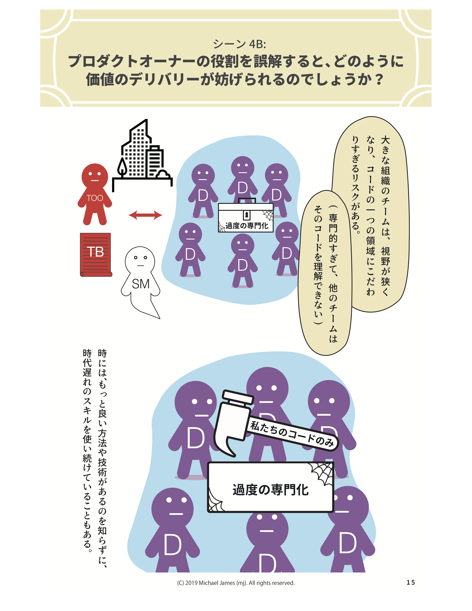

<!--
title: 'My Code, Your Code.  Private code policies considered harmful to agility.'
excerpt: 'Tying particular people or teams to particular parts of the code has several negative impacts.'
-->

[{: .align-center width="440"}](/Why-Scrum-Isnt-Making-Your-Company-Very-Agile/)

<!-- 
Watch out for *private code policies and practices*.  Tying particular people or teams to particular parts of the code has several negative impacts:
-->

*プライベートコードポリシーやその習慣*には注意してください。コードに対して担当者や担当チームを割り当ててしまうと、いくつかの悪影響が出てしまいます。

<!-- 
Teams don't work in priority order.  Some teams or individuals do lower valued work, creating *inventory*.  Other teams or individuals become bottlenecks, causing *Work In Progress* (WIP) queues and delaying end-to-end cycle time.
-->

1．チームが優先順位に従って仕事をしない。優先順位の低い仕事を行い、*在庫*を生産するチームや人がいます。他のチームや人は*仕掛品*（WIP）の渋滞を生み出し、エンドツーエンドサイクルタイムに遅れを生み出して、ボトルネックとなります。

<!--
In dark corners, our code starts to stink.  Fewer people see it, write tests for it, and refactor[^1] it.  A lack of automated tests makes *continuous integration* more difficult and *continuous delivery* impossible.  The lack of automated tests makes it even scarier for other people to change the code (for fear of introducing regression failures).  The lack of refactoring makes the code difficult to understand and change.  If sunlight is the best disinfectant, private code practices are the best incubator for code rot.  Taken together, these things discourage other people from working on the code, which makes it stink even more.
-->

２．暗い片隅で、私たちのコードは腐っていきます。それを見てテストを書き、リファクタリング[^1]する人は少なくなります。自動化テストがないため、*継続的な統合*はより難しくなり、*継続的な納品*は不可能になります。自動化テストがないために、他の人はコード変更を一層恐ろしく感じます（リグレッションの失敗への恐怖）。リファクタリングがないため、コードは難解で変更しづらいものとなります。太陽光を最高の消毒剤だとすると、プライベートコードの慣行はコードを腐らせる最高の孵化器です。これらが合わさると、他の人はコードに取り掛かるのを躊躇し、コードはさらに悪臭を放つようになります。

<!--
Our knowledge and skills do not improve as much as they would when we see other parts of the system.  In our little bubble, we have no idea how much else there is to learn about software development.

Ultimately the customer suffers and our company becomes less competitive.
-->

３．私たちの知識とスキルは、システムの他のパーツを見た時に最も向上します。自らの小さなカプセル内にいては、ソフトウェア開発について他に学ぶべきことがどれだけあるのか分かりません。

４．結局のところ、顧客は迷惑し、自分たちの会社の競争力は低下することになります。

<!--
Possible Remedies

Craig Larman and Bas Vodde have written the most comprehensive list of remedies to the My Code, Your Code problem that I've seen:
<https://less.works/less/technical-excellence/architecture-design.html#Behavior-OrientedTips>.
-->

[^1]: The purpose of source code is not only to communicate with the computer running the program.  Source code should also communicate with the people working on it, now and in the future.  As properly defined by Martin Fowler, to *refactor* means to improve the design of existing code, generally in tiny incremental steps, to keep it understandable and maintainable, without changing behavior.  Refactoring is not practical unless we're writing automated tests as we write the code.

<!--
[{: .align-center width="400"}](/Why-Scrum-Isnt-Making-Your-Company-Very-Agile/)
-->

English version: <http://seattlescrum.com/my-code-your-code/>
