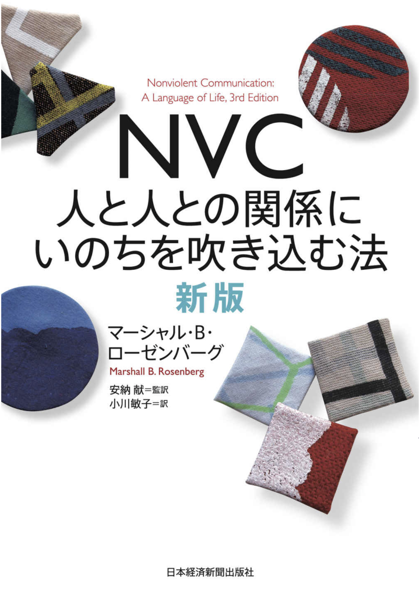

1. 積極的に何もしないこと。例えば、黙って観察しながら、介入したい衝動を抑える。
2. チームを考えさせたり、議論を促進するような問いかけをする
3. 中立的な観察をする。 観察と評価を分けるNVCのテクニックを使う。
4. 行動をモデリングする（お手本になる。）つまり、他のチームメンバーに真似して欲しいように振る舞う。 技術力のあるスクラムマスターの場合、人とのペアプログラミングなども含む。
5. 最後の手段：割り込む。

{: .align-center width="150"}

以下も参照してください。
* {: width="300"}
* [Actively doing nothing](https://less.works/blog/2019/12/16/actively-doing-nothing.html) by Bas Vodde.
* [スクラムトレーニングシリーズ ・ モジュール6](http://scrumtraining.jp/6-Sprint-Retrospective/)
* [スクラムマスターチェックリスト](https://scrummasterchecklist.org/pdf/Scrum-Master-Checklist-jp.pdf)

