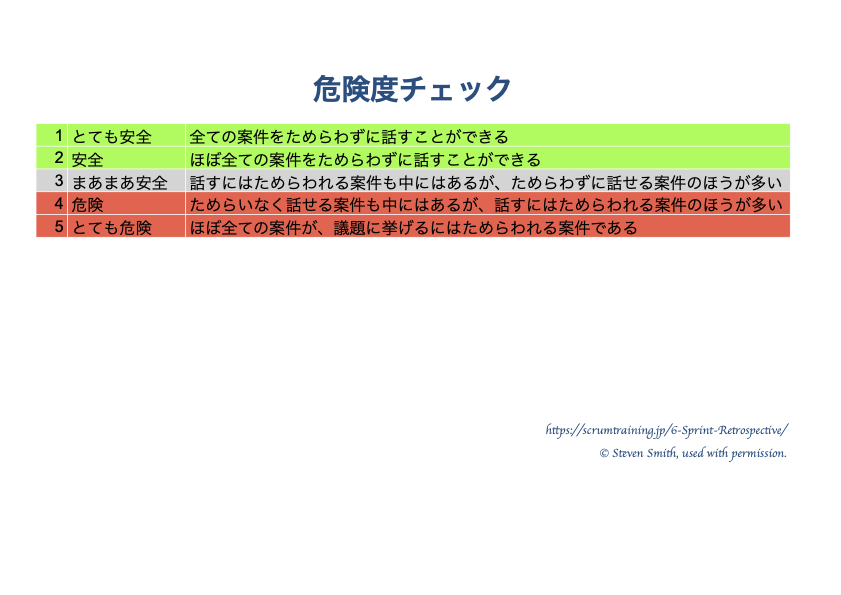

----

<https://scrumtraining.jp/6-Sprint-Retrospective/>

----

MJ:

> ようこそ、スクラムトレーニングシリーズの第６回、スプリントレトロスペクティブへ。私はMJです。
> 
> レトロスペクティブは、スプリントレビューの後に行うスプリントの最後のイベントです。スプリントレビューのフィードバックはレトロスペクティブにも影響を与えます。
>
> スプリントレビューは、プロダクトの検査と適応を推進する場でした。一方でスプリントレトロスペクティブは、チームの働き方（プロセス）を検査と適応する機会を提供してくれます。
> 
> レトロスペクティブは、スクラムを学習のフレームワークとして用いる際の鍵であり、私たちが日頃目にする固定的なプロセスではありません。
> 
> 複雑な世界では、学習するチームと学習する組織だけが生き残ることができます。スクラムマスターの目標は、学習するチームを作ること、最終的には学習する組織になるための環境を作り出すことです。
> 
> 近年のスクラムにおいては、プロダクトオーナーもレトロスペクティブに参加する必要があることが示唆されています。もし参加しなかったら、開発者はプロダクトオーナーについて文句を言うだけで、何も変わらないかもしれません。プロダクトオーナーを参加させることに心理的安全上の懸念がある場合は、ブレイクアウトグループを使ったり、2段階のレトロスペクティブを行ったりすることも可能です。
>
> 例えば、あなたが従業員数二桁以上の会社にいるとします。 チームを取り巻く仕組みや方針ではなく、個人のパフォーマンスやチームのパフォーマンスに注目してしまうという罠にはまるかもしれません。
> 
> プロダクト全体を見渡せば、レトロスペクティブに参加すべき他の人々や他のチームも見つかるでしょう。学習する組織になるための有意義な一歩を踏み出そうとするならば、広い視野を持つ必要があります。
> 
> チームごとのレトロスペクティブに加え、チーム同士の働き方を変えるためのオーバーオールレトロスペクティブを実施し、チームに影響を与えるシステム的・組織的な問題に挑戦することをお勧めします。
>
> ロジャー・シュワーツ著「ファシリテーター完全教本」によると、「ファシリテーターはグループの議論の内容に直接介入しません。介入は、中立性を放棄し、グループから問題解決に対する責任をとりあげることになります」とあります。
> 
> スクラムマスターの傾聴とファシリテーションのスキルは大きな違いを生みます。 
>
> 自己組織化を宣言しているチームであっても、各個人の見えない地位はすべてのやりとりに影響します。また、他の人が自分の考えを把握する前に、意見を形成し、それをすぐに声に出して表現する傾向が強い人もいます。
> 
> 優れたファシリテーターは、チームからより多くの視点を引き出すために、時には見えない地位の平準化のテクニックを使うこともあります。
> 
> このモジュールでは、私が便利だと思ったテクニックを自分なりに解釈して紹介します。 
> これらのテクニックの発案者の意図とは異なることをご紹介するかもしれませんので、最後に情報元を参照することにします。
いつものように、途中でクイズを出します。
{: .notice}

----

## クイズ・効率的なチーム vs. 学習するチーム

質問: ヘンリー・フォードは、変化しない状況に慣れるほど、適応力が低下することを発見しました。不確実な世界において、スクラムマスターが集中すべき領域はどちらでしょうか？

* 効率的なチーム。もっと！もっとたくさん！より良く!より速く!
* 学習するチーム。学習するチームは、必要な時に効率的な状態に転じることができます。

----

# 第1章　セーフティーチェック　心理的安全性の確認

> 多くの人は、チームは心理的安全性が確保された環境でこそ、率直な対話ができることを理解しています。
> しかし、チームの場の中で安全だと感じている人が、他の人も同じレベルの安心感を持っていると思い込むという間違いがよくあります。優れたファシリテーターは、感じ方は人それぞれだと理解しています。
> 
> スクラムマスターは、一人一人が安全だと感じていると仮定せずに、匿名の安全確認から始めることをお勧めします。
> 
> 私たちのスクラムマスターが、スティーブン・スミスというファシリテーターが推奨する安全確認の手順を踏むのを見てみましょう。
{: .notice}

チームルームに入る。 壁には危険度チェックのポスターが貼ってある。

スクラムマスター:

> レトロに入る前に心理的安全性の確認をします。各自に白紙の投票用紙を渡します。何も書き込まずに少々お待ちください。
> 
> あなたの人生で、安全でない、不快である、または厄介であると感じた状況について思い出してみてください。
> 
> 逆に、最も快適でリラックスできた状況を思い出してください。
> 
> では、このレトロをやっている今の気持ちをお聞きします。
> 安全性グラデーションの数字を書き、他の人が読めないように投票用紙を折ってください。
> 安全だと感じている参加者も、他のメンバーの匿名性を守るために、自分の選択を明かさないでくださいね。
>
> では、皆さんの投票を集めて集計してみます。 帽子の中に入れてください。

数字は3、4、2、3、2、1。スクラムマスターは集計表に印をつける。

----

## クイズ・スクラムマスター

質問: ロジャー・シュワーツによると、ファシリテーターは内容に関して中立的であるべきで、グループのファシリテーターへの依存を減らすよう試みるべきだといわれています。これに従うと、スクラムマスターは次に何をすべきなのでしょうか？

* 誤り：心理的安全確認の結果について、自分の意見を発表する。
* 心理的安全確認の結果について、グループで議論、解釈するように問いかける。

----

スクラムマスター:

> では、チームの皆さん、レトロの本編に入る前に、この結果をどのように解釈していますか？

----

MJ:

> 心理的安全性の確認は初期のスクラム本には記載されていません。
> しかし、特にスクラムの開始段階で、必要に応じて心理的安全性の確認を行うことに価値を見いだすチームが増えています。
> ただし心理的安全確認だけでは、完全なレトロスペクティブにはなりません。
> 心理的安全性が非常に低い場合は、チームを3〜4人のグループに分けることも有効です。
> 
> 数週間前、あるグループのレトロスペクティブに立ち会いました。その一室には１５人ほどおり、誰がチームメンバーなのか不明確であるにもかかわらず、そのグループは「スクラムをやっている」と言っていました。
>
> また、彼らはプロダクトオーナー以外の人たちにも説明責任がありました。これはスクラムに違反しています。
{: .notice}

## 見えない銃効果

> 心理的安全性に関する最後のポイントです。職場で、上司が部屋に入ってきた途端に、生産的な会話が止まってしまう瞬間に居合わせたことがあると思います。
>
> たとえその上司が、以前は管理される側で、上司になることを望まなかった、親切で役に立つ人であったとしても、です。
> 私は、これを 「見えない銃効果」と考えています。
> 
> ボスは誰も傷つけるつもりはなく、ただ助けるためにそこにいるのだから、銃は見えないかもしれません。
> しかし、部下は、会社が上司に、誰が昇進し、誰がレイオフされた場合に残るのか、などの権限を持たせているのを知っています。
> 
> 部下は、内心では上司の目に自分がどう映っているか気がかりになることもあるでしょう。これは、チームの自己組織化に大きなダメージを与えます。このようなダメージは水面下で形成されるので、通常は表立って取り沙汰されることはありません。
> 
> 場合によっては、チームは、他の誰かが仕事をやってくれるかもしれないことに気付いたときに、チーム自身の責任を拡大しないことがあります。
> 私の友人であるトバイアス・メイヤーは、この問題には「退室による管理」という対処法をとっています。
> 
> 位置関係による相互作用の諸々の影響を、チームのメンバーの一人一人が認めようとしないため、スクラムマスターがそういった影響を把握するのは難しいかもしれません。私が一緒に仕事をしていたあるグループは、この問題を懸念して、管理職を直属の部下とは別のチームに配属しました。
>
> 同じような問題は、契約社員や派遣社員を含む非正規雇用人員やリモート勤務人員、SIer（エス　アイアー）やプロジェクトカンパニーなどのアウトソーシング会社でも起こりえます。
{: .notice}

----

## クイズ・観客

質問: チーム外の人物を招待することで、レトロスペクティブの心理的安全性は高まることになりますか？

* はい。まるでプロレスの場外乱闘を見ているような感じです。
* いいえ。もし、チームが外部の人と問題を議論する必要がある場合は、通常、レトロスペクティブの後に行う方がよいでしょう。

## クイズ・スプリントレトロスペクティブ

質問: 心理的安全性の確認だけで、スプリントレトロスペクティブは完了しますか？

* はい。
* いいえ。

----

# 第2章： 従来のスクラムのレトロスペクティブ

MJ:
> スクラムは、何がうまくいき、何を改善したらいいのかを議論すること以外、レトロスペクティブの特定の実践方法を定義していません。
> これらを概してプラス/デルタ(Good/Motto)と呼ぶのが一般的です。※Goodは良かったこと、Mottoは「もっと」、つまり改善ポイントです。
> その他にも「何を学んだか」「何がまだ理解不足か」などをテーマにすることもできます。
> 
> チームの人々が、アクションに関する合意に繋がる会話をするということです。
> ウォーターフォール型プロジェクトのポストモーテムのように最後まで待つのではなく、スプリントごとにこれを行います。
> 
> では、その様子をご覧ください。
{: .notice}

チームルームに入る。

チームメンバーが最後のスプリントについて何が良かったのか、何が気に入らなかったのかを話し合っている様子を観察します。
彼らはそれをポスト・イット・ノートに書き、+ と Δ の欄に記入する。

チームメンバーは、取るべき行動のリストを書き出す。

~~~
デイリースクラムの時間を午前9時から午前10時に変える。
完了の定義の明確化：UI変更に伴うヘルプメニューの改訂。
次のスプリント・プランニングでは、PBIを取りすぎない。
バックログリファインメントで、PBIをより小さく分割する。
コーディング規約に関するチームの合意事項を修正する。
摩擦音のしないペンを用意する。
~~~

MJ:
> これが、典型的なレトロスペクティブの例です。
{: .notice}

---

## クイズ・レトロスペクティブ頻度

質問: スクラムでは、スプリントレトロスペクティブはどれくらいの頻度で実施されるのでしょうか？

* 毎日
* スプリント毎
* プロジェクト毎

---

# 第3章：要点をおさえた会話の原則

