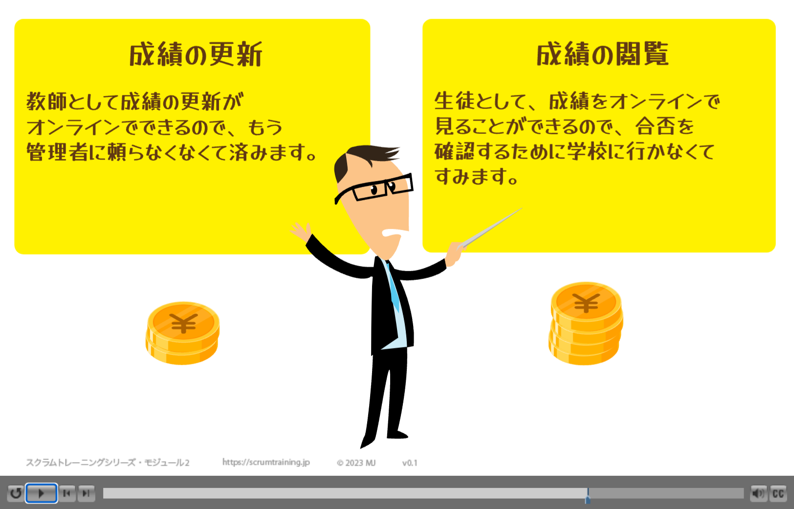

----

<https://scrumtraining.jp/2-Backlog-Refinement/>

MJ: 

> スクラム研修パート２：バックログリファインメントへようこそ。 私はMJです。私はスクラムやアジャイルプラクティスを実践する企業を支援しています。
> 
> バックログリファインメントはスクラムに必要ですが、このビデオにあるようなミーティングである必要はありません。
>

スクラムタイムライン（カレンダー)図の表示

> 私は、次のスプリントプランニングの数日前にリファインメントを行うことをおすすめしています。これによってプランニングで具体的な計画をたてる前にプロダクトオーナーが優先順位を考える時間を少し確保できるからです。
> チームルームでどのようなことが起きているのか、見てみましょう。途中でクイズを出しますので、注意深く観察してください。

チームルーム内

> バックログリファインメントには、プロダクトオーナーと職業横断的で自己組織化された開発チームが参加します。必要とされた時や求められた時のみスクラムマスターも参加します。ここでは、顧客やエンドユーザーも含めるべきです。
> 
> 大規模スクラム（LeSS)ではさらに他のチーム、またはチームの代表者を含めることになります。
> 
> このチームは、学校が生徒の学習状況を把握するための生徒情報システムを開発し始めたところです。

スクラムマスター:

> こんにちは。 私がバックログリファインメントをファシリテーションします。 タイムボックスは２時間です。
> 
> 優先順位の高いプロダクトバックログアイテムを明確にし、分解していきましょう。
>
> ビジネス価値を生み出す作業や、チームの時間や労力を要する事柄はすべて、プロダクトバックログに載せてください。
> プロダクトバックログ・リファインメントの目的の一つは、洗練されたプロダクトバックログアイテムを作ることです。洗練されたプロダクトバックログアイテムは、独立し、交渉可能で、価値があり、見積もりが可能で、小さく、テスト可能です。

---

グラフィックには INVEST： Independent（独立した）、Negotiable（交渉可能）、Valuable（価値がある）、Estimable（見積もり可能）、Small（小さい）、Testable（テスト可能）とある。<https://xp123.com/articles/invest-in-good-stories-and-smart-tasks/>
{: .notice}

### クイズ・INVEST前半

質問: ビル・ウェイクによれば、”INVEST”という頭字語は、洗練されたプロダクトバックログアイテムがどのようなものかを覚えるのに役立つといいます。最初の３文字は何を表していますか？

* Immutable（変わらない）, Necessary（なくてはならない）, Vast（巨大な）。
* Independent（独立した）, Negotiable（交渉可能な）, Valuable（価値のある）。
* Incoherent（支離滅裂な）, Nebulous（不明瞭な）, Vaporous（空想的な）。
* Idealistic（理想主義な）, Noble（壮大な）, Valiant（立派な）。

### クイズ・INVEST後半戦

質問: ビル・ウェイクによれば、”INVEST”という頭字語は、洗練されたプロダクトバックログアイテムがどのようなものかを覚えるのに役立つといいます。最後の３文字は何を表していますか？

* Ecclesiastical（聖職の）, Sacred（神聖な）, Truthful（誠実な）。
* Easy（易しく）, Sane（健全な）, Traceable（遡ることができる）。
* Estimable（見積もり可能な）, Small（小さく）, Testable（テスト可能な）。
* Effective（効果的な）, Secure（安全な）, Trusted（信頼された）。
* Enormous（巨大な）, Severe（厳しく）, Tricky（トリッキーな）。

[ビル‧ウェイク の INVEST](/downloads/INVEST.pdf)
{: .notice}

---

スクラムマスター:

> プロダクトオーナー、あなたはプロダクトビジョンとROIに責任を持ちます。まず、あなたの考える優先順位を私たちに教えてくれませんか？

プロダクトオーナー:

> このプロダクトのビジョンからプロダクトバックログアイテムに優先順位をつけると、成績、出席状況、イベントカレンダー、卒業生記録、そして奨学金授与の順番になります。あと、私はページをかっこよくしたいです。いつごろできそうですか？

開発者田中: 

> 現時点ではなんとも言えません。要件を書き終えたら教えてほしいです。

---

### クイズ・開発者の参加 1

質問: スクラムマスターは次に何と言うべきでしょう？

* そうですね、開発チームは、マーケティング部門がすべての要件を文書化するまで待つべきです。
* ここは、プロダクトバックログアイテム・要件を参加者全員で練り上げる場です。アジャイルで成功するには、ビジネス側の人と開発者はプロジェクトを通して日々一緒に働かなければなりません。このリファインメントでは、プロダクトバックログの上位３つだけに的をしぼりましょう。
* リファインメントは、私たちが要件を一緒に検討し学ぶ場です。すべてのプロダクトバックログを検討し終わるまで部屋の外へ出てはいけませんよ。

---

開発者井上:

> 私はただのテスターだから開発のことは何もわからないんです。テストの話が始まるまで携帯で遊んでてもいいですか？

---

### クイズ・開発者の参加 2

質問: スクラムマスターは次に何と言うべきでしょう？

* 私はスクラムマスターです。あなたはスクラムの奴隷なんですよ。あなたにリファインメントに参加するよう命じます。
* あなたはただのテスターなので、今は参加する必要はありません。メールか何かでテストの見積もりを出してください。プロジェクトの最終フェーズから参加してもらうことになります。リソースを最大限に活用することが大切です。
* あなたはテストに非常に強いかもしれませんが、今は開発チームのメンバーです。チームの一員として、スプリントごとに出荷可能なプロダクトを実現する責任があります。チームがあなたの関わり方をどう考えているか聞いてみましょう。

---

開発者佐藤:

> 以前はコードを書いたら、他の部署にテストをお願いしてましたよ。今はテスト経験豊富なあなたと同じチームだからこのミーティングに参加して欲しいです。

開発者井上:

> ええっと、君のために働いてるわけじゃないんです。

開発者佐藤:

> ぼくたちはあなたのために働きますよ。自己組織化したチームは、全員がお互いのために働くんです。

開発者井上:

> わ、わかりました。

開発者井上が会議に再合流。

スクラムマスター:

> このミーティングは時間が限られているので、今はプロダクトバックログアイテムの最上位にある、「成績」に集中しましょう。
> 
> このプロダクトバックログアイテムを出荷可能にするために必要な作業量をみなさんから聞きたいと思います。見積もりカードを利用してみましょう。

このチームは、TシャツサイズS、M、L、XXXXLの４枚のカードを使ったゲームで見積もりをしています。これ以上サイズを複雑にしないことをおすすめします。 もっとシンプルにするチームもあります。「S」か「Sに作り直そう」のどちらかです。
{: .notice--danger}

スクラムマスター:

> 「成績」のプロダクトバックログアイテムを完成させるための作業量を見積もります。１人１枚カードを選んで、みんな一斉に選んだカードを見せ合いましょう。

開発者たちは互いにカードを公開し合う。 予想が一致しない。

スクラムマスター:

> 選んだ理由を聞いてみましょう。

開発者中川：

> 私がSを選んだ理由は生徒の成績表示が数行のコードで済むからです。

開発者鈴木：

> 私がXLを選んだ理由はこんな漠然とした要求ではどうテストを始めたらいいかイメージできないからです。

開発者井上:

> 私がLを選んだ理由は教師が成績を表示するだけでなく更新することも要件に含まれていると思ったからです。

プロダクトオーナー:

> 実は、教師は成績を更新できること、学生は成績をオンラインで見れること、そして報告カードを各学期ごとに両親に送信できる機能が欲しかったんです。

「成績」PBIが巨大化。 開発者たちは怯えた様子だ。

プロダクトオーナー:

> みなさんの助けが必要なことがわかりました。「成績」のプロダクトバックログアイテムをみんなで一緒にもっと明確にしましょう。

---

### クイズ・INVEST

質問: 成績のプロダクトバックログアイテムを引き続き明確化する理由は何ですか？

* 独立性がない、交渉可能ではない、価値が無いから。
* 見積可能ではない、小さくない、テスト可能じゃないから。

---

スクラムマスター:

> チームには「成績」のプロダクトバックログアイテムがエピックに見えたようです。
> 
> エピックは複数の異なるユーザーストーリーに分割することができます。エピックの分割はバックログリファインメントの目的の一つです。

スクラムの要素：プロダクトバックログアイテム (PBI)。\\
スクラムの要素ではないが、よく使われる：ユーザーストーリー、エピック。\\
ユーザストーリーは、小さなプロダクトバックログアイテムの一例です。\\
エピックは、大きなプロダクトバックログアイテムの一例で、スプリントに入る準備ができていないものです。
{: .notice--danger}

スクラムの公式用語は、プロダクトバックログアイテム、略してPBIです。ユーザーストーリーやエピックはスクラム用語ではありません。 これらはあなたがよく見かけるプロダクトバックログアイテムの例です。 ユーザーストーリーは小さなプロダクトバックログアイテムの例、エピックは大きなプロダクトバックログアイテムの例と言えるでしょう。
{: .notice}

スクラムマスター:

> 大抵の人は、ほとんどの製品のほとんどの機能を使ってないことがわかっています。
> 彼らが使っている機能でさえ、より価値のあるものと価値の低いものとで分けることができます。
> 
> 優先順位の高い洗練されたプロダクトバックログアイテムは、スプリントの4分の1以下の大きさです。
>
> 「成績」のプロダクトバックログアイテムをより価値のあるプロダクトバックログアイテムに小さく分割できるかもしれませんね。

開発者田中：

> 利用実績のないサードパーティのPDFライブラリを使う予定なので、報告カードの作成はとても難しいでしょう。

プロダクトオーナー:

> 教師がオンラインで成績を更新できるようになれば、「報告カード」の優先順位を一番下にしても今のところは構わないと思います。
> 先生方は、紙の記録を提出する前になくしてしまう傾向が多いからです。

スクラムマスター:

> プロダクトバックログアイテムは、誰が、何を、なぜするのかを明確にするとしばしば役に立つことがあります。
> 例えば、「成績の閲覧」: 生徒として成績をオンラインで見ることができます...

ユーザー：

> なぜなら、合否を知るために学校に行く必要がなくなるからです。

開発者井上(彼はショックを受けて驚いているようだ。)：

> だれがユーザーをプロダクトバックログ・リファインメントに招待したのですか？

---

### クイズ・ユーザー参加

質問: なぜプロダクトバックログ・リファインメントにエンドユーザーを含めるべきなのでしょうか？

* (ユーザーから開発者に)正確で詳細な明確さを提供するため。
* プロダクトオーナーがボトルネックにならないようにするため。
* 開発者はユーザーとの共感を感じ、自分の仕事に意味を持たせることができるため。

---

プロダクトオーナー:

> 私がユーザーをお呼びしました。明確化の手助けをしてもらうことにしたのです。そうすれば、私がボトルネックになることはありません。ビジョンや優先順位は私が決めます。

免責事項: ご紹介したwho/what/why/Connextraテンプレートは、人気のツールです。しかし、これは元々ユーザーストーリーアイデアの一部ではありませんでしたし、これ以外にも方法はあります。 
このテンプレートや他のテンプレートにも、あまりこだわらないでください。
{: .notice--danger}

Kent Beck 氏はこのように言っています。「私達がこれまでで最高の給与計算システムを作って、ユーザーに話を聞く未来を想像してみましょう。彼らははそれをどのように利用したかのストーリーを話してくれるでしょう。私達はそのストーリーを書き留め、現在に戻ってそれを作るのです。」
{: .notice}

~~~
「成績の閲覧」
生徒として、成績をオンラインで
見ることができるので、合否を
確認するために学校に行かなくて
すみます。
~~~

開発者田中：

> わかりました。「誰が」と「何を」と「なぜ」が書いてあるんですね。ある程度独立していて、それぞれに明確なビジネス価値を表しています。

開発者鈴木：

> みんなで一緒に取り掛かれば、数日で出荷できるくらいには小さくなると思います。

開発者井上:

> 一見するとテスト可能に見えます。

---

### クイズ・ビジネス価値

質問: ホイール荷重センサーを使って地上待機を検知する旅客機の開発をしていると想像してみてください。 どのプロダクトバックログアイテムがINVESTのV（価値あるもの）と最も一致していますか？

* ホイール荷重センサーを組み込む。
* 飛行機が地上に降りると、乗客のドアのロックが自動的に解除される。

MJ:

> 私は「飛行機が地上に降りると、乗客のドアのロックが自動的に解除される」ことの方が、直接的な価値の例だと考えています。なぜなら、"ホイール荷重センサーを組み込む"よりもユーザー（航空会社の乗客）にとっての利益が明確だからです。
>
> チームは、ホイール荷重センサーやドアをロックするアクチュエーターの組み込みを行う必要があります。これは垂直方向に薄くスライスしたものと考えることができます。
> センサーとアクチュエーターを統合するための技術的な検証は、スプリントプランニングの中で、スプリントのタスクとして出てくるでしょう。
> これについては、次のeラーニングモジュールでご説明いたします。
> 
> プロダクトバックログアイテムは課題領域である”What”に焦点を当てていると考えてください。その後、スプリントプラニングでチームはスプリントのタスクを作成することで解決領域である”How”に取り組むことになります。
> 
> あなたの組織は１つのチームよりも大きいですか？エンドユーザー中心のプロダクトバックログアイテムを書くのに苦労していませんか？もしそうなら、問題は組織設計にあるかもしれません。
> あなたの組織は、チームが複数のアーキテクチャ上のコンポーネントを横断して仕事をする組織設計になっていない可能性があります。
> 残念なことに、伝統的な組織は、ユーザーのニーズに沿ってチームを構成する代わりに、技術的なコンポーネントに沿って水平的にチームを構成しています。
> これによりアジリティを減少させていることが多いのです。
> 
> スクラムマスターはマネージャーと共にフィーチャーチームが育つように組織に働きます。 詳細は <https://less.works/less/structure/feature-teams.html?preferred_lang=jp&setlang=true>を読んで下さい。
{: .notice}

---

プロダクトオーナー:

> 「成績の更新」についてはどうですか？ 

ユーザー：

~~~
「成績の更新」
教師として、成績の更新が
オンラインでできるので、もう
管理者に頼らなくなくて済みます。
~~~

スクラムマスター:

> 成績の閲覧より重要ですか？それとも重要ではありませんか？

プロダクトオーナー:

> 優先順位を付けるのですか？私はこれらの機能を一度に全部欲しいです。

開発者田中：

> 僕はポニーが欲しいよ。

---

### クイズ・優先順位付け　１

質問: ほとんどの人は、ほとんどのソフトウェア製品のほとんどの機能を利用しますか？

* はい。成功するかどうかは、すべてをやりとげるかどうかです。
* いいえ。多くのユーザーは、頻繁に利用する20％の機能がしっかりテストされていれば良いと考えています。

### クイズ・優先順位付け　２

質問: 効果的なスクラムの場合、優先順位をプロダクトバックログにどのように表現しますか？

* プロダクトバックログアイテムを「P1」、「P2」、「P3」等に分類します。
* 上位のプロダクトバックログアイテムは下位のものより重要です。上位にあるプロダクトバックログアイテムには、特に明確に優先順位を付けます。

---

プロダクトオーナー（イライラ、不機嫌そう）:

> 最もビジネス的価値があるのは「成績の閲覧」でしょう。もし「成績の更新」が終わらなくても、管理者は旧システムを使って成績を更新することができますから。旧システムを使うのは、あまり望まないですが。

プロダクトオーナーはPBIを順番に配置する。

スクラムマスター:

> プロダクトバックログの優先順位付けはいつでも自由に変更できます。

開発者田中：

> この順番で仕事を進めることをここで約束しないのですか？

スクラムマスター:

> バックログリファインメントでは約束はしません。
> 
> 次のスプリントプランニングで、着手するプロダクトバックログアイテムを選択します。開発チームは、次のスプリントでどれだけの仕事を引き受けるか決めることになります。

残念ながら、通常「チーム」または「開発チーム」と呼ばれるグループは、2020 スクラム ガイドでは「開発者」と呼ばれています。
{: .notice--danger }

---

### クイズ・優先順位付け　３

質問: プロダクトバックログアイテムの優先順位を決める最終的な責任は誰にありますか？

* スクラムマスター
* プロダクトオーナー
* 開発チーム
* 外部のステークホルダー
* 1人の責任ではない。多数決で決める。

---

開発者井上:

> 「成績の閲覧」のプロダクトバックログアイテムを見積もってみましょう。

~~~
成績の閲覧
生徒として、成績をオンラインで
見ることができるので、合否を
確認するために学校に行かなくて
すみます。
~~~

開発者はそれぞれカードを選ぶ。 同時にカードを公開する。 井上を除くすべての開発者が S のカードを選んだ。 井上は M のカードを選んだ。

開発者佐藤（せっかち）：

> ほんの数行のコードです。

開発者鈴木：

> 私はSに同意します。UIデザインはとてもシンプルです。

開発者中川：

> このアイテムはデータベースを変更しないので、技術的なリスクもテストにかける労力も少ないです。

開発者井上:

> 私はそうは思いません。私がMを選んだ理由は前学期の成績は別の旧システムに保存されているからです。

開発者佐藤：

> そうそう、忘れてました。これは過去の学期にも使えますか？それとも今学期だけでしょうか？

プロダクトオーナー:

> 聞かれるまで考えていませんでした。今学期に関心があります。過去の学期はしばらく必要ないでしょう。

プロダクトオーナーは「成績の閲覧」のPBIを2つに分ける。これで2つのタイトルは「今学期の成績の閲覧」と「前学期の成績の閲覧」となった。

新しいPBI

~~~
前学期の成績の閲覧: 
生徒として、通知表を紛失したため、
オンラインで過去の成績を見る
ことができます。
~~~

プロダクトオーナーはPBIを順番に配置する。

---

### クイズ・